# 🧭 Mapa Conceptual de Madurez — De la Biografía de Jhon a Cosmos

> Este documento es la vista de pájaro del workshop: cómo cada concepto que construyes a mano evoluciona hasta convertirse en el motor real de las aplicaciones de **Sincosoft Cosmos** (`Cosmos.BuildingBlocks` → CritterStack). La regla de oro: *todo lo que haces a mano aquí, Cosmos ya lo tiene encapsulado en producción.*

---

## 🌱 La progresión de madurez (el "por qué" de cada paso)

Cada fase nace de un **dolor** que la anterior dejó abierto:

```mermaid
graph LR
    A["①  Estado<br/>(la Foto)"] -->|"se pierde el pasado"| B["②  Eventos<br/>(el Diario)"]
    B -->|"¿cómo reconstruyo<br/>el presente?"| C["③  Apply / Replay"]
    C -->|"se repite en cada<br/>entidad"| D["④  AggregateRoot"]
    D -->|"¿dónde guardo<br/>los eventos?"| E["⑤⑥  EventStream<br/>+ Event Store"]
    E -->|"¿quién orquesta<br/>cargar-actuar-guardar?"| F["⑦⑧  Command<br/>Handler"]
    F -->|"RAM se borra al<br/>apagar"| G["⑪  Docker +<br/>PostgreSQL"]
    G -->|"escribir SQL/JSON<br/>a mano es doloroso"| H["⑫  Marten"]
    H -->|"¿quién enruta<br/>50 comandos?"| I["⑬  Wolverine"]
    I -->|"¿y si falla a la<br/>mitad del envío?"| J["⑭  Outbox<br/>Transaccional"]
    J -->|"leer eventos para<br/>consultar no escala"| K["⑮⑯  CQRS +<br/>Proyecciones"]
    K -->|"todo junto,<br/>multi-tenant"| L["⑰  Plantilla<br/>Cosmos"]
```



---

## 🗺️ Tabla maestra: concepto → workshop → código real de Cosmos

| Concepto | Sección | Lo construyes a mano como… | En Cosmos vive en… |
|----------|---------|----------------------------|--------------------|
| Event Sourcing (hechos, no estado) | 01 | Lista de eventos `record` | Eventos de dominio en cada Bounded Context |
| Replay / `Apply` | 03 | `foreach` en el constructor | Marten lo hace; misma firma `Apply(Evento)` |
| `AggregateRoot` | 04 | Clase base con `Id` + eventos | `Cosmos.EventSourcing.Abstractions.AggregateRoot` (con `UncommittedEvents`) |
| `EventStream` + Event Store | 05-06 | `InMemoryEventStore` (diccionario) | `MartenEventStore : IEventStore` |
| Guardar / rehidratar | 12 | `session.Events.StartStream` / `AggregateStreamAsync` | **Exactamente** `MartenEventStore.StartStream()` y `querySession.Events.AggregateStreamAsync<T>()` |
| Command Handler | 08 | Clase con `Handle(comando)` | Handlers descubiertos por Wolverine en cada dominio |
| Enrutamiento de comandos | 13 | `bus.InvokeAsync(comando)` | `WolverineCommandRouter` → `messageBus.InvokeForTenantAsync(tenantId, command)` |
| Transacción atómica | 13-14 | `SaveChangesAsync()` manual | `UnitOfWorkMiddleware` + `AutoApplyTransactions()` |
| Transactional Outbox | 14 | (no lo haces a mano — semanas) | `.IntegrateWithWolverine()` + `DurabilityMode` + `WolverinePublicEventSender` / `WolverinePrivateEventSender` |
| CQRS / Proyecciones | 15-16 | (pendiente) | `MartenProjectionStore`, `WolverineQueryRouter` |
| Multi-tenancy | (Cosmos) | — | `ITenantResolver`, `InvokeForTenantAsync`, sesiones FIFO por tenant |

---

## 🧩 Los 3 pilares mentales (para conceptualizar)

1. **El Diario, no la Foto.** La fuente de verdad es la secuencia de hechos. El estado actual es una *derivación* (replay). Esto te da auditoría, time-travel y proyecciones gratis.

2. **El Agregado es la frontera de consistencia.** `Persona` (o `TenantOnboarding` en Cosmos) decide qué eventos son válidos y los emite. Nadie escribe en el stream sin pasar por él. Marten/Wolverine solo transportan y persisten; la regla de negocio vive en el agregado.

3. **Atomicidad o nada.** Guardar el evento *y* avisar a otros sistemas debe ser una sola transacción, o se rompe la consistencia (el "Mensajero Muerto"). Por eso Marten (datos) + Wolverine (bus) comparten transacción y usan Outbox: el evento y su intención de publicación se guardan juntos; un worker los reenvía después con reintentos.

---

## 🔬 Anclaje al código real (Cosmos.BuildingBlocks / CritterStack)

```
Cosmos.EventSourcing.CritterStack/
├── Commands/MartenEventStore.cs        → tu InMemoryEventStore, pero con Marten
├── Commands/WolverineCommandRouter.cs  → tu bus.InvokeAsync, pero multi-tenant
├── Queries/MartenProjectionStore.cs    → CQRS lado lectura (Secciones 15-16)
├── Queries/WolverineQueryRouter.cs     → enrutamiento de queries
└── WolverineExtensions.cs              → la config: IntegrateWithWolverine,
                                           UnitOfWorkMiddleware, AutoApplyTransactions,
                                           DurabilityMode.Solo (serverless/Functions)

Cosmos.EventDriven.CritterStack/
├── WolverinePublicEventSender.cs       → publica eventos a otros BC (Service Bus)
└── WolverinePrivateEventSender.cs      → eventos internos del BC
```

> [!NOTE]
> **Detalle de producción que el workshop simplifica:** Cosmos corre en **Azure Functions (.NET isolated)**, así que en `WolverineExtensions` se usa `AddWolverine(ExtensionDiscovery.ManualOnly, …)` en vez de `UseWolverine()`, para evitar que Wolverine intente descubrir DLLs que no existen en el host serverless (rompía con `Microsoft.Azure.WebJobs`). Es el tipo de fricción real que solo entiendes cuando ya dominas el concepto base — por eso primero lo construyes a mano.

---

## 🎓 Cómo usar este mapa
- **Antes de cada sección:** ubica en qué nodo del diagrama estás y qué dolor resuelve.
- **Después de cada sección:** abre el archivo real de Cosmos correspondiente y confirma que reconoces el patrón.
- **Meta de madurez:** poder explicar, sin mirar, por qué Cosmos necesita Marten + Wolverine + Outbox + multi-tenancy, partiendo de la biografía de Jhon.
