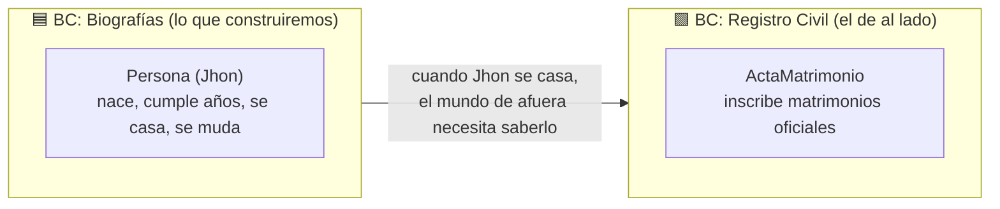

# 01b - El mapa: tu Bounded Context y el mundo de afuera

> 📍 **Encuadre temprano.** Antes de escribir una sola línea, fijemos el mapa del mundo que vamos a construir. Este mapa hace que todo lo que viene después —eventos privados/públicos, traducción de mensajes, contexto— tenga un lugar claro desde el principio, en vez de aparecer "de la nada" al final.

## La frontera que lo organiza todo: el Bounded Context

En la Sección 01 dijimos que vamos a modelar la **biografía de Jhon**. Pero Jhon no existe en el vacío: vive dentro de un **límite** con su propio lenguaje y sus propias reglas. A ese límite, en DDD, se le llama **Bounded Context** (contexto acotado).

Piensa en una empresa: el área de **Recursos Humanos** y el área de **Contabilidad** hablan de "la misma persona", pero con **lenguajes distintos**. Para RH es un *empleado* con cargo y vacaciones; para Contabilidad es un *tercero* con cuenta por pagar. Mismo humano, dos modelos, dos mundos. Cada uno es un Bounded Context.

> [!IMPORTANT]
> Un **Bounded Context** es una frontera dentro de la cual un modelo y su lenguaje son coherentes. Fuera de esa frontera, las mismas palabras pueden significar otra cosa. **Todo lo que construyas vive dentro de un Bounded Context** — y conviene saber cuál desde el primer día.

## Nuestro mundo: dos contextos

En este workshop construiremos **un** contexto a fondo, pero desde ya queremos que veas que **no está solo**:



- **Biografías** (lo nuestro): la vida de Jhon.
- **Registro Civil** (el vecino): lleva el registro oficial de matrimonios.

No comparten base de datos ni código. Son **mundos separados** que, a veces, necesitan **avisarse cosas**.

## Dos clases de hecho: el que se queda y el que cruza

Esta es la idea que iremos explicando módulo a módulo. Cuando algo le pasa a Jhon, hay **dos posibilidades**:

1. **Se queda adentro.** *"Jhon cumplió años"* solo le importa a Biografías. Es un hecho **interno** (lo llamaremos **evento privado**).
2. **Cruza la frontera.** *"Jhon se casó"* le importa al Registro Civil (afuera). Es un hecho que se vuelve **público** (un **evento de integración**) y debe viajar al otro contexto.

```
        Dentro de Biografías          │   Cruza al Registro Civil
   ─────────────────────────────────  │  ──────────────────────────
   PersonaNació        (privado)       │
   CumpleañosCelebrado (privado)       │
   PersonaCasada       (privado) ──────┼──▶  MatrimonioCelebrado (público)
                                       │
```

> [!NOTE]
> 🌱 No necesitas resolver esto ahora. Solo **graba el mapa**: estás construyendo *dentro* de un contexto; algunos hechos se quedan, otros cruzan. A lo largo del workshop iremos puliendo: cómo se marca cada uno (§14), cómo se traduce lo que llega de afuera sin contaminar tu dominio —*Anti-Corruption Layer*— (§24), cómo viaja el contexto del mensaje —*Envelope*— (§25), y al final veremos los dos contextos hablando completos (§26).

## 🎭 El elenco del workshop (referencia única)

Para que el ejemplo sea **un solo hilo** de principio a fin, todo el workshop usa estos dos contextos y sus piezas. Cuando veas un ejemplo, será de aquí — los dominios reales de Cosmos (Orden de Compra, Obligación, Contabilidad) aparecen **solo** en las cajas "🪐 Ancla Cosmos".

**🟦 BC Biografías** (lo que construimos)
- Agregado: **`Persona`** (Jhon)
- Comandos: `RegistrarMatrimonio`, `RegistrarMudanza`
- Eventos privados: `PersonaNació`, `CumpleañosCelebrado`, `HijoNacido`, `PersonaCasada`, `PersonaMudada`
- Evento de integración (público): **`MatrimonioCelebrado`**

**🟩 BC Registro Civil** (el vecino, aparece desde §24)
- Agregado: **`ActaMatrimonio`**
- Comando interno: `InscribirMatrimonio`
- Evento privado: `MatrimonioInscrito`
- ACL: `BiografiasAcl` (traduce `MatrimonioCelebrado` → `InscribirMatrimonio`)

> Mantener este elenco fijo es lo que hace que cada concepto nuevo **mueva el mismo ejemplo un paso adelante**, en vez de abrir un dominio distinto cada vez.

## Por qué te lo decimos tan temprano
Si dejáramos el "afuera" para el final, cada decisión de diseño (¿cómo nombro este evento? ¿quién puede verlo? ¿esto es un comando o un evento?) se sentiría arbitraria. Con el mapa en la cabeza desde ahora, cada pieza encaja: **sabes si estás trabajando dentro de la frontera o cruzándola.**

---

### El Descubrimiento
Tu primer concepto de arquitectura no es un evento ni un agregado: es la **frontera**. Construirás Biografías por dentro, pero siempre sabiendo que hay un mundo afuera (Registro Civil) con su propio lenguaje, y que comunicarse con él tiene reglas. Ese mapa es la brújula del resto del workshop.

---

[⬅️ Volver a El diario de Jhon](./01-el-diario-de-jhon.md) · [➡️ Preparando el lienzo](./02-preparando-el-lienzo.md) · [🗺️ Roadmap](../ROADMAP.md)
