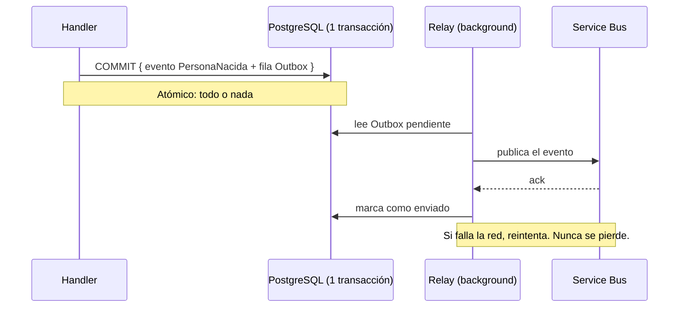

# 14 - El Compromiso Inquebrantable: El Transactional Outbox

En la Sección 13, Wolverine y Marten ya comparten una transacción: cuando el Handler de `RegistrarPersona` termina, el evento `PersonaNacida` se guarda en PostgreSQL de forma atómica. 

Pero falta una pieza. En un sistema real, guardar el evento no es suficiente: hay que **avisar a otros**. Cuando Jhon nace, quizá Contabilidad necesita crear su ficha, Notificaciones debe mandarle un correo, y otro Bounded Context resta un cupo. Ese aviso viaja por la red (Azure Service Bus). Y la red **falla**.

---

## 💥 El problema: el "Mensajero Muerto"

El instinto del desarrollador es escribir esto:

```csharp
// ❌ PELIGRO: dos infraestructuras, sin atomicidad
public async Task Handle(RegistrarPersona comando, IDocumentSession session)
{
    var evento = new PersonaNacida(Guid.NewGuid(), comando.Nombre, DateTime.UtcNow, comando.Ciudad);
    session.Events.StartStream<Persona>(evento.PersonaId, evento);
    await session.SaveChangesAsync();          // 💾 1) Guardado en PostgreSQL  → OK

    await _serviceBus.PublishAsync(evento);    // 📨 2) Aviso por red          → 💥 TimeoutException
}
```

Dos escenarios catastróficos:

- **La base guarda, la red falla:** el evento existe en PostgreSQL, pero nadie se enteró. Contabilidad nunca creó la ficha. Inconsistencia silenciosa y permanente — la app no tiene forma de saber que el aviso se perdió.
- **Invertimos el orden y la base falla:** avisamos primero y luego la BD revienta. Mandamos un correo de un Jhon que no existe.

Esto se llama **Consistencia Dual fallida**: intentar hacer dos cosas en dos infraestructuras distintas y caer en la mitad.

---

## 📬 La solución: Transactional Outbox (la bandeja de salida)

La idea es elegante: **no toques la red dentro del Handler**. En su lugar, guarda el "quiero enviar este mensaje" en la **misma base de datos**, dentro de la **misma transacción** que el evento de negocio.

### Fase 1 — El cajón local (una sola transacción)
1. `BEGIN TRANSACTION`
2. Guardar el evento `PersonaNacida` en el event store.
3. En la **misma** base, insertar en la tabla **Outbox** el mensaje "publicar `PersonaNacida`".
4. `COMMIT`.

Si algo falla, **ambos inserts se revierten**. Nunca hay un evento sin su intención de envío, ni viceversa.

### Fase 2 — El cartero del sótano (relay en background)
Un proceso vigila la tabla Outbox. Cuando ve un mensaje pendiente, lo envía por la red (Service Bus). Si la red falla, **reintenta** en segundos. Solo cuando confirma el envío, marca el mensaje como enviado. Resultado: **entrega garantizada** (al menos una vez).



---

## 🐺 Con Wolverine + Marten: una línea

Construir a mano la tabla Outbox, el worker en background, los reintentos y el evitar duplicados puede tomar **semanas**. Wolverine + Marten lo traen nativo. Recuerda la config de la Sección 13:

```csharp
builder.Services.AddMarten(options =>
{
    options.Connection(connectionString);
    options.Events.AddEventType<PersonaNacida>();
})
.IntegrateWithWolverine();   // ← esto ya activa el Inbox/Outbox durable sobre PostgreSQL
```

Cuando un Handler emite un mensaje en cascada (lo devuelve o usa `IMessageBus`), Wolverine lo guarda en su tabla Outbox **dentro de la misma transacción de Marten**, y su relay lo entrega después. Tú solo escribes la intención:

```csharp
public class RegistrarPersonaHandler
{
    // Wolverine: el valor devuelto es un "mensaje en cascada" que se publica vía Outbox
    public PersonaNacida Handle(RegistrarPersona comando, IDocumentSession session)
    {
        var evento = new PersonaNacida(Guid.NewGuid(), comando.Nombre, DateTime.UtcNow, comando.Ciudad);
        session.Events.StartStream<Persona>(evento.PersonaId, evento);
        // No publicamos a la red aquí. Devolvemos el evento:
        // Wolverine lo guarda en el Outbox en la MISMA transacción y lo entrega después.
        return evento;
    }
}
```

> [!IMPORTANT]
> La regla de oro: **dentro del Handler nunca llamas a la red directamente.** Emites mensajes (return / `IMessageBus`) y dejas que el Outbox de Wolverine garantice la entrega. Así el "Mensajero Muerto" no existe.

---

## 🧬 Evolucionemos: ¿qué eventos publicamos al resto del sistema?

Recoge la semilla de §01 ("no todos los hechos le importan a todo el mundo"). Cuando Jhon se casa, emites `PersonaCasada`. ¿La publicamos al bus para que *todos* los demás servicios se enteren?

```csharp
// 💥 Lo ingenuo: publicar TODOS los eventos al bus
foreach (var evento in agregado.EventosNuevos)
    await bus.PublishAsync(evento);
// Problema: PersonaCumplioAños es un detalle INTERNO; nadie afuera lo necesita.
// Y si otro Bounded Context se "engancha" a un campo interno de PersonaCasada,
// quedamos acoplados: no podremos cambiar ese evento sin romperle a otros.
```

La distinción es de diseño: hay eventos **de dominio** (internos, dentro de tu Bounded Context) y eventos **de integración** (públicos, contrato con otros BCs). Marcamos cada uno y dejamos que el agregado los separe:

```csharp
// 🔧 Marcamos el alcance de cada evento con interfaces (las de Cosmos)
public record PersonaCumpleañosCelebrado(...) : IPrivateEvent;   // interno: se queda en casa
public record PersonaCasada(Guid Id, string Pareja) : IPublicEvent; // integración: otros lo necesitan

// El AggregateRoot ya sabe separarlos (API real de Cosmos.BuildingBlocks):
IPrivateEvent[] internos = persona.GetPrivateEvents();  // se procesan dentro del BC
IPublicEvent[]  publicos = persona.GetPublicEvents();   // SOLO estos van al bus
```

> [!TIP]
> 🏷️ **El nombre.** Un `IPublicEvent` es una **API pública**: una vez publicado, otros equipos dependen de su forma (por eso su versionado, §19, es tan delicado). Un `IPrivateEvent` puedes cambiarlo con libertad. Regla: **publica al bus solo lo público**; mantén lo interno, interno.

> [!NOTE]
> 🌱 **Semilla — y al revés: cuando recibes un evento público de OTRO servicio, no lo manejes directo.** Si tu handler reacciona directamente a un `IPublicEvent` ajeno, acoplas tu dominio a una firma que no controlas. La solución es una **Anti-Corruption Layer**: una capa-frontera que valida el evento externo y lo **traduce a un comando interno** de tu propio lenguaje. Y el contexto (tenant, usuario) de ese mensaje no viaja en el payload, sino en el **Envelope** (el sobre). Lo dominamos en §24 (ACL) y §25 (Envelope).

## 🪐 Cómo lo hace Cosmos

En `Cosmos.BuildingBlocks` esto está encapsulado:

- `Cosmos.EventSourcing.CritterStack/WolverineExtensions.cs` llama `.IntegrateWithWolverine()` y fija `options.Durability.Mode = DurabilityMode.Solo` — modo durable apropiado para **Azure Functions (.NET isolated)**, donde no hay un proceso siempre vivo que haga leader election.
- `Cosmos.EventDriven.CritterStack/WolverinePublicEventSender.cs` publica los eventos **públicos** (los que cruzan a otros Bounded Contexts vía Azure Service Bus); `WolverinePrivateEventSender.cs` los internos.
- El transporte real es **Azure Service Bus** con **sesiones FIFO por tenant** (`SessionId = TenantId`), para que los eventos de un mismo tenant se procesen en orden estricto (lo que documentaste en `cosmos_project_history.md`).

> [!NOTE]
> Tu bug histórico del `TypeLoadException` en `WolverinePublicEventSender` vive justo en esta capa. Entender el Outbox y el modo de durabilidad es el contexto que necesitas para atacarlo.

> [!NOTE]
> 🌱 **Semilla — ¿y si un mensaje falla una y otra vez?** El relay del Outbox reintenta los envíos fallidos. Pero hay mensajes "venenosos" que **fallan siempre** (un evento corrupto, un consumidor con un bug). Reintentarlos para siempre bloquearía la cola. La solución estándar de la industria es la **Dead Letter Queue (DLQ)**: tras N reintentos, el mensaje se aparta a una "cola de cartas muertas" para inspección manual, sin frenar al resto. Wolverine y Azure Service Bus la traen integrada. Guárdalo: la entrega garantizada del Outbox se complementa con la DLQ para los casos que *nunca* van a pasar.

---

### El Descubrimiento
Con el Outbox, tu sistema pasa de "ojalá llegue el mensaje" a **"el mensaje llegará, garantizado"**. El evento de negocio y su publicación son atómicos; la red ya no puede dejarte a medias.

**¿Pero cómo consultamos todo esto eficientemente? Reproducir todos los eventos de Jhon cada vez que alguien quiere ver su edad no escala.** Para eso separamos lectura de escritura: **CQRS y Proyecciones**, en la próxima sección.

---

[⬅️ Volver a la sección anterior](./13-wolverine.md)

[➡️ Siguiente sección: El Censo — Límites del Event Store y CQRS](./15-limites-busqueda.md)
