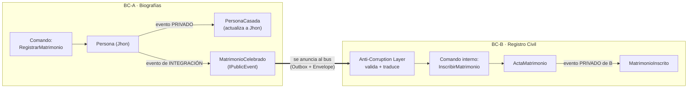

# 26 - Dos Bounded Contexts hablando: qué vive dentro y qué cruza la frontera

> 🌳 Aquí se vuelve **tangible** la distinción privado vs público. Hasta ahora todo pasaba dentro de un solo contexto (la **Agencia de Biografías**). Vamos a crear un **segundo** Bounded Context y hacer que se comuniquen — así se ve, en código, qué evento es "de adentro" y cuál "cruza la frontera".

## El problema de claridad
Decir *"evento privado vs público"* en abstracto confunde. La pregunta correcta no es *"¿este evento es público?"* en el vacío, sino: **"¿público respecto a qué frontera?"**. Un evento solo es "interno" o "de integración" **en relación con un Bounded Context concreto**. Necesitamos dos contextos para verlo.

## Nuestros dos contextos

- **BC-A — Biografías** (el que ya conocemos): gestiona la vida de Jhon como `Persona`.
- **BC-B — Registro Civil** (nuevo): lleva el registro **oficial** de los matrimonios del país. No le importa la biografía de Jhon; solo le importa inscribir matrimonios.

Cuando Jhon se casa, **algo tiene que pasar en los dos**: Biografías actualiza el estado de Jhon, y el Registro Civil debe inscribir el matrimonio. Pero son **equipos, repos y bases de datos distintos**. ¿Cómo se enteran?

### 🟢 El intento ingenuo: que Biografías llame al Registro Civil

Lo primero que se nos ocurre: cuando Jhon se casa, Biografías **llama directamente** a la API del Registro Civil.

```csharp
// En el handler de Biografías, tras casar a Jhon:
jhon.RegistrarMatrimonio("María");
await registroCivilApi.InscribirMatrimonio(jhon.Id, "María", DateOnly.FromDateTime(DateTime.Today)); // 😬
```

### 💥 El dolor

Esa sola línea acopla los dos contextos de tres formas:
- **Acoplamiento de conocimiento:** Biografías ahora *conoce* al Registro Civil (su URL, su API, su forma). Justo lo que el Bounded Context quería evitar. ¿Y si mañana Notificaciones y Estadísticas también quieren enterarse? Biografías tendría que llamarlos a **todos**.
- **Acoplamiento temporal:** si el Registro Civil está caído, **el matrimonio en Biografías falla**. Un problema ajeno tumba tu operación.
- **Responsabilidad invertida:** Biografías tendría que saber *qué hace* el Registro Civil con el dato. No es asunto suyo.

### 🔧 La vuelta: anunciar un hecho y olvidarse

¿Y si Biografías **no llama a nadie**, solo **anuncia que algo pasó** y sigue con su vida?

```csharp
// Biografías: "esto ocurrió". Punto. No sé ni me importa quién escucha.
publicar(new MatrimonioCelebrado(jhon.Id, "María", hoy));
```

Quien necesite reaccionar (Registro Civil, Notificaciones, quien sea) **se suscribe** a ese hecho y actúa a su ritmo. Biografías no conoce a nadie; si un consumidor está caído, procesará el hecho cuando vuelva, sin afectar a Biografías.

### 🏷️ El nombre: Event-Driven Architecture (EDA)

Eso es **EDA**: en vez de *ordenar* a otros qué hacer (llamadas), **anuncias hechos** (eventos) y dejas que **0..N interesados** reaccionen, **desacoplados en conocimiento y en tiempo**. No la adoptamos por moda — la necesitamos en el instante en que *un hecho cruza la frontera y otros deben reaccionar*, porque la alternativa síncrona acopla todo.

> [!NOTE]
> 🧭 **Cuándo NO es EDA.** EDA es para **notificar hechos** (push: "ya pasó esto"). Si lo que necesitas es **pedir un dato ahora** (pull: "dame el saldo actual"), eso es una **query síncrona**, no un evento. No todo cruce de frontera es EDA: reaccionar a hechos sí; consultar datos no.

Con EDA en la cabeza, así se ve la comunicación completa (y por fin el bus tiene sentido):



---

## Los tres niveles de "alcance" en código

### 1. Dentro de BC-A: el evento privado
`PersonaCasada` es un hecho **interno** de Biografías. Sirve para actualizar a Jhon. Nadie afuera lo ve.

```csharp
// BC-A · Biografías  —  evento PRIVADO
public record PersonaCasada(Guid PersonaId, string NombrePareja) : IPrivateEvent;
```

### 2. Lo que cruza la frontera: el evento de integración
Que Jhon se casó **sí** le importa al mundo exterior. Pero **no publicamos `PersonaCasada`** tal cual: eso ataría al Registro Civil a la forma interna de Biografías. Publicamos un evento **dedicado, estable y público**, pensado como contrato:

```csharp
// BC-A · Biografías  —  evento de INTEGRACIÓN (contrato público y estable)
public record MatrimonioCelebrado(Guid PersonaId, string NombrePareja, DateOnly Fecha) : IPublicEvent;
```

> [!IMPORTANT]
> 🏷️ **Regla clave (clarifica todo).** El evento **privado** (`PersonaCasada`) y el **de integración** (`MatrimonioCelebrado`) pueden describir el "mismo hecho", pero son **dos contratos distintos a propósito**: uno es interno y libre de cambiar; el otro es público y debes versionarlo con cuidado (§19). **Nunca uses tu evento privado como contrato público** — acoplarías a otros a tus detalles internos.

El agregado emite ambos; la infraestructura sabe que solo el público sale al bus (recoge §14: `GetPrivateEvents()` / `GetPublicEvents()`).

### 3. Dentro de BC-B: recibir, traducir, actuar
El Registro Civil **no maneja `MatrimonioCelebrado` directamente** (§24): lo pasa por su **ACL**, que valida y lo traduce a un **comando interno** suyo. El contexto (tenant, usuario) llegó en el **Envelope** (§25), no en el payload.

```csharp
// BC-B · Registro Civil  —  ACL: evento externo -> comando interno
public static class BiografiasAcl
{
    public static InscribirMatrimonio Handle(MatrimonioCelebrado externo) // ← evento ajeno entra aquí
    {
        if (externo.PersonaId == Guid.Empty)
            throw new EventoInvalidoException("MatrimonioCelebrado sin PersonaId");

        // Traducimos al lenguaje de NUESTRO dominio (no al de Biografías)
        return new InscribirMatrimonio(
            CiudadanoId: externo.PersonaId,        // en RC se llama "Ciudadano", no "Persona"
            Conyuge:     externo.NombrePareja,
            FechaActa:   externo.Fecha);
    }
}

// BC-B · comando y agregado PROPIOS — desacoplados de Biografías
public record InscribirMatrimonio(Guid CiudadanoId, string Conyuge, DateOnly FechaActa);

public class ActaMatrimonio : AggregateRoot
{
    public void Inscribir(InscribirMatrimonio cmd)
        => RaiseEvent(new MatrimonioInscrito(cmd.CiudadanoId, cmd.Conyuge, cmd.FechaActa)); // privado de B
}
```

Fíjate en el detalle del **lenguaje ubicuo** (§07 fundamentals): en Biografías es `Persona`; en Registro Civil es `Ciudadano`. La misma realidad, **dos lenguajes** — y eso está bien, porque son **dos Bounded Contexts**. La ACL es justamente el traductor entre esos dos idiomas.

---

## El cuadro que aclara "dentro vs fuera"

| Evento / mensaje | ¿Dónde vive? | ¿Cruza la frontera? | Contrato |
|---|---|---|---|
| `PersonaCasada` | dentro de BC-A | ❌ no | privado, libre de cambiar |
| `MatrimonioCelebrado` | sale de BC-A | ✅ sí (al bus) | público, estable, versionado |
| `InscribirMatrimonio` | dentro de BC-B | ❌ no | comando interno de B |
| `MatrimonioInscrito` | dentro de BC-B | ❌ no | privado de B |

> El mismo "hecho de la vida real" (Jhon se casó) aparece **cuatro veces** con cuatro formas distintas, cada una correcta **en su contexto**. Eso es lo que significa que el alcance de un evento es **relativo al Bounded Context**.

---

## 🪐 Ancla Cosmos
Así se hablan los BCs reales: **ObligacionesPorPagar**, **Contabilidad**, **Impuestos**. Cada uno publica sus `IPublicEvent` (integración) y consume los de otros a través de su propia ACL, con el contexto viajando en el envelope y la entrega garantizada por el Outbox. Tu workshop ahora modela, en pequeño, exactamente esa topología.

---

### El Descubrimiento
"Privado vs público" deja de ser abstracto cuando hay **dos** contextos: privado = vive dentro de un BC; integración = el contrato estable que cruza al otro. El puente seguro entre ellos son los tres patrones que ya construimos: **evento de integración** dedicado (§14), **ACL** que traduce (§24) y **Envelope** que lleva el contexto (§25). Un mismo hecho, varios idiomas, fronteras limpias.

**Siguiente natural:** cuando ese cruce implica varios pasos coordinados (inscribir → notificar → facturar), entra la **saga**.

---

[⬅️ Volver a Envelope y contexto](./25-envelope-y-contexto.md) · [🗺️ Roadmap](../ROADMAP.md) · [🏛️ La Plantilla Cosmos](./17-plantilla-cosmos.md)
